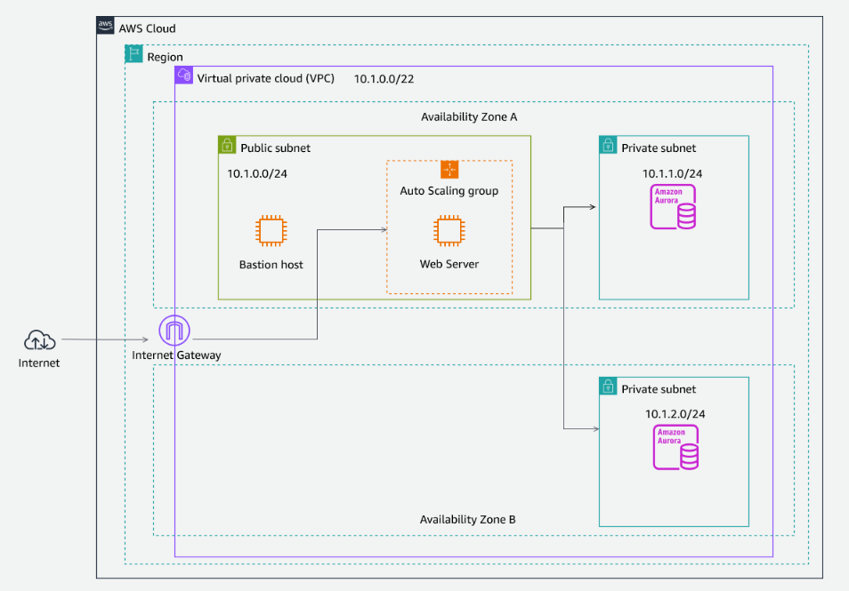

# aws_networking

실습 주소(이번주 금요일 까지)
> https://tinyurl.com/y8d7edcf

- 첫시간
5단계 간략 설명, 실습은 알아서.

## 1. AWS 기반 네트워킹
- 리전 : 물리적인 데이터 센터
- 가용영역 :  논리적인 그룹, aws 3개 이상의 가용영역 있음, 100~150km
- subnet은 가용영역 단위에 배포
- VPC와 subnet ip 비트 단위 찾아보기

## 2. AWS에서의 로드 밸런싱 및 크기 조정

## 3. VPC 상호 연결 및 콘텐츠 전송

## 4. Amazon Route 53을 통한 고가용성

## 5. 과정 마무리