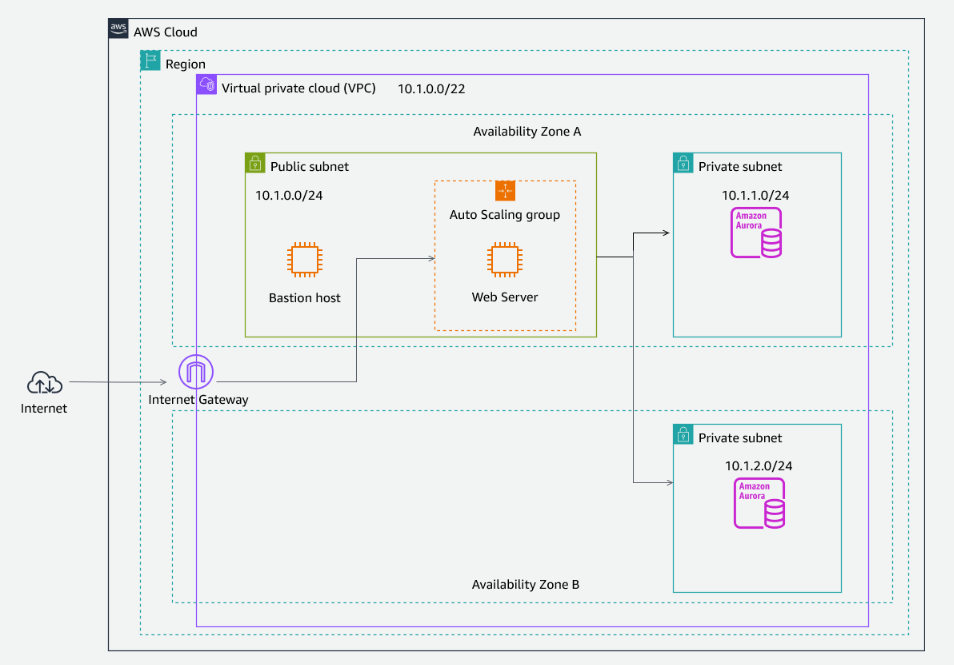
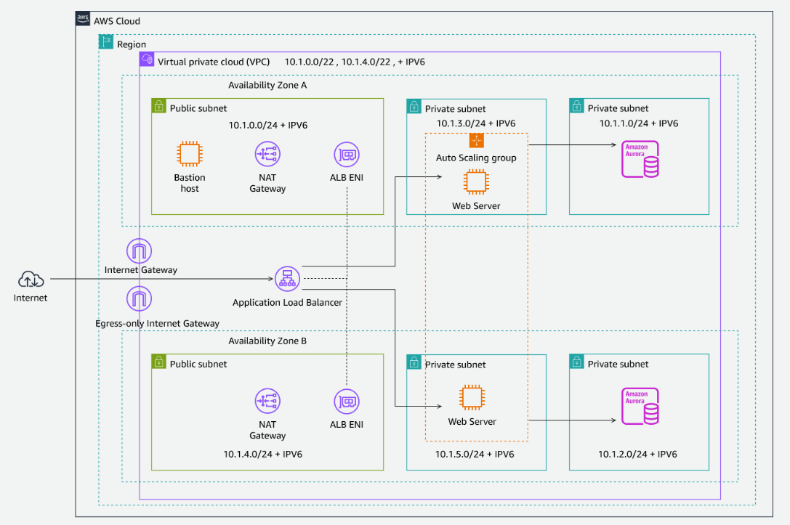

# aws_networking

실습 주소(이번주 금요일 까지)
> https://tinyurl.com/y8d7edcf

- 첫시간
5단계 간략 설명, 실습은 알아서.

## 1. AWS 기반 네트워킹
- 리전 : 물리적인 데이터 센터
- 가용영역 :  논리적인 그룹, aws 3개 이상의 가용영역 있음, 100~150km
- subnet은 가용영역 단위에 배포
- VPC와 subnet ip 비트 단위 찾아보기

- 클래스 없는 도메인 간 라우팅(CIDR) <- CIDR 찾아보기
    - CIDR 표기법은 IP 주소와 해당 네트워크 마스크를 표시하는 방법
        - IPv4주소는 8비트로 구성된 4개의 그룹 (10.22.0.0/16)
            - /16은 네트워크 식별을 위해 처음 16비트를 예약함, 나머지 비트는 호스트 범위 (10.22.0.0~10.22.255.255)
            - 예 : 192.168.10.10
        - IPv6주소는 128비트이며 16비트 또는 4개의 16진수로 구성된 8개 그룹으로 나눔
            - a:b:c:d:e:f:g:h 각각 16비트
            - 보통은 64비트를 network 주소, 나머지 64비트를 호스트로
            - 예 : 2001:0db8:1234:1a00:00fc:0000:0000:0001

## 2. AWS에서의 로드 밸런싱 및 크기 조정

## 3. VPC 상호 연결 및 콘텐츠 전송

## 4. Amazon Route 53을 통한 고가용성

## 5. 과정 마무리